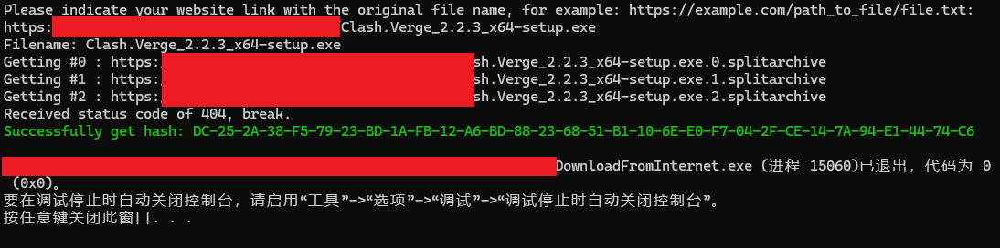
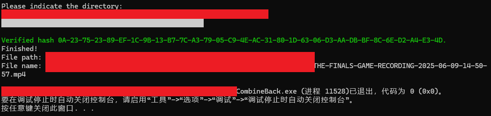

<!-- Markdown提示/错误等：https://github.com/orgs/community/discussions/16925-->

<h1>Split archive</h1>

[中文](https://github.com/1234567Yang/SplitArchive) [English](https://github-com.translate.goog/1234567Yang/SplitArchive?_x_tr_sl=zh-CN&_x_tr_tl=en&_x_tr_hl=zh-CN&_x_tr_pto=wapp)

 

还在为 Cloudflare pages 文件最高 25MB 发愁？不如试试分卷压缩！

 

~~我们的宗旨：~~
* ~~薅秃 Cloudflare~~
* ~~把 Cloudflare pages 当不限速网盘用~~

 

> [!NOTE]  
> 对于大于 25MB 的视频文件，有时间我会写一个把 MP4 转为 m3u8 的程序。

分卷压缩：

 
从网络上下载：

 
还原：

